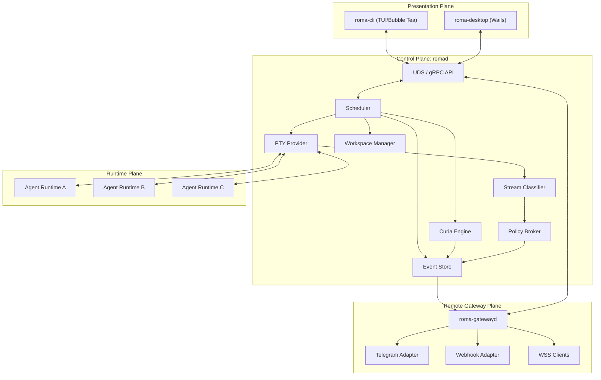

# ROMA Design Document

**ROMA (Runtime Orchestrator for Multi-Agents)** is a daemon-first local orchestration kernel for interactive AI coding runtimes. This document merges the current repository design with the formal RFC direction and defines the baseline architecture for implementation.

## 1. Positioning

ROMA is not another wrapper around a single AI CLI. It is a local execution kernel that turns unreliable model behavior into an auditable engineering workflow through:

* `romad` as the execution source of truth
* structured artifacts as the only handoff contract
* isolated workspaces as the write boundary
* policy enforcement above all model decisions
* event persistence for replay and recovery

The system is designed for local development workflows that need long-running sessions, multi-agent coordination, approval gates, and deterministic recovery semantics.

## 1.1 Implementation Snapshot (2026-03-12)

This document is the target architecture, not a claim that every subsystem below is fully implemented today. As of 2026-03-12, the repository is best understood as:

* a mostly-realized daemon-first control plane
* a usable workspace/scheduler/persistence kernel
* a staged Curia implementation with automatic promotion, `Augustus` arbitration, and structured consensus metadata
* a usable but still incomplete runtime classifier, gateway plane, and presentation plane

Current alignment against the design:

### Largely aligned today

* `romad` is the execution truth source for queue, session, task, artifact, lease, and recovery state
* SQLite-backed metadata plus filesystem blobs are in use
* Git-worktree-backed isolated execution exists for writable tasks when the target repository supports it
* artifact envelopes are the handoff contract between nodes
* PTY-backed runtime supervision exists for supported coding-agent CLIs
* local daemon APIs exist for queue, session, task, workspace, plan, status, and result inspection

### Partially aligned / MVP today

* Curia exists, including `proposal`, `ballot`, `debate_log`, `decision_pack`, `execution_plan`, dispute classification, reviewer weights, automatic promotion, an `Augustus` path, arbitration confidence, consensus strength, and dissent summaries, but it is not yet the fully autonomous high-confidence consensus engine described later in this document
* the Policy Broker has pre-flight checks, approval gates, path-aware enforcement, execution-plan apply controls, a first transport/pattern/semantic runtime classifier, and a second-layer AI semantic review path, but it does not yet have the mature confidence-scored runtime semantics or full action/role matrix described later in this document
* execution-plan preview, inbox, approve/reject, apply, rollback, structured conflict summaries, conflict context, and resolution options exist, but conflict resolution UX is still operator-heavy
* gateway support exists as a bridge and approval hook, but not yet as a production-ready `roma-gatewayd` with mature WSS/retry/dead-letter behavior

### Major gaps relative to the target architecture

* the Stream Classifier described in Section 7.4 now has an initial implementation, but not yet the mature confidence-scored semantics and policy automation described in the target architecture
* automatic scheduler promotion into Curia exists for risky multi-agent runs and graph nodes, but it is not yet a complete risk/conflict escalation system
* presentation-plane goals for a real TUI and desktop client are not implemented in the repository today
* gateway deployment, remote endpoint management, and rich remote watch/control remain incomplete

Rough implementation percentages, for planning purposes only:

* control plane and persistence: `~90%`
* workspace isolation and scheduler: `~85%`
* Curia engine: `~65-70%`
* policy and runtime classification: `~45-50%`
* gateway plane: `~20-25%`
* presentation plane: `~0-5%`

## 2. Goals and Non-Goals

### 2.1 Goals

ROMA v1 should:

* manage interactive AI CLIs through a daemonized runtime
* decouple sessions from any frontend client
* support `rage`, `collab`, and `senate` as the user-facing `roma run` modes, plus staged `Curia` execution where policy or graph orchestration requires it
* enforce artifact-only handoff between task nodes
* isolate writes with Git worktrees
* persist session state, artifacts, transcripts, and decisions
* support attach, detach, replay, approval, and recovery

### 2.2 Non-Goals

ROMA v1 does not attempt to:

* provide distributed cloud scheduling
* replace formal Git platform code review
* support arbitrary third-party CLIs without adapters
* allow free-form agent-to-agent context sharing
* solve every failure mode automatically
* support multi-host sandbox orchestration

## 3. Design Principles

### 3.1 Daemon-first

All execution truth lives in `romad`, not in CLI or GUI clients.

### 3.2 Artifact-only handoff

Agents do not directly talk to each other. They exchange structured outputs only.

### 3.3 Isolation over sharing

Concurrent or high-risk work must happen in isolated workspaces, not the main working tree.

### 3.4 Policy above intelligence

No agent, including an arbitration agent, can bypass system policy or approval rules.

### 3.5 Replayability first

Every meaningful state transition must be reconstructable from persisted data.

### 3.6 Explicit failure semantics

Each stage must define whether a failure is recoverable or terminal, and what resumes it.

## 4. System Architecture

ROMA follows a four-plane architecture: control plane, presentation plane, runtime plane, and remote gateway plane.

### 4.1 Topology



### 4.2 Plane Responsibilities

#### Control Plane: `romad`

Owns:

* session and task state machines
* DAG scheduling
* PTY lifecycle
* artifact validation and persistence
* runtime interception and approval suspension
* replay and recovery

#### Presentation Plane: clients

Owns:

* rendering and interaction
* terminal output display
* DAG, artifact, diff, and approval views

Clients never hold business truth.

#### Runtime Plane: agent runtimes

Owns:

* third-party AI CLI execution
* controlled stdin/stdout/stderr interaction
* emission of natural language, structured JSON, diffs, and tool output

#### Remote Gateway Plane: gateway services

Owns:

* remote event fan-out
* notification aggregation
* remote approval and control bridging
* endpoint authentication and delivery control

Gateway services never become execution truth.

## 5. User-Facing Run Modes

The current `roma run` CLI exposes three orchestration modes:

### 5.1 Rage

Single-agent execution with explicit worker/foreman rounds. This is the default when the run has one agent and no delegates. The loop continues until the worker emits `ROMA_DONE:` or the round budget is exhausted.

### 5.2 Collab

Starter-led collaboration. The starter agent scopes the work, delegates execute in isolated workspaces, and the starter reviews, synthesizes, and prepares merge-back output.

### 5.3 Senate

Multi-agent proposal, voting, implementation, and winner-selection flow. This is the default when the run has multiple agents.

### 5.4 Curia

Consensus mode for high-risk or disputed work outside the normal `roma run` mode list. Curia has four phases:

1. `Scatter`
2. `BlindReview`
3. `DisputeDetection`
4. `Arbitration`

Curia is not a normal `roma run --mode` value. It is triggered by scheduler policy, graph execution, or explicit Curia-oriented flows.

## 6. Curia Triggering

The scheduler may upgrade a task into Curia when any of the following hold:

* sensitive paths are touched, such as `.github/`, `infra/`, `auth/`, `billing/`, `migrations/`
* projected file impact exceeds a threshold
* public API changes are involved
* schema or data model changes are involved
* cross-module dependencies are affected
* historical failure rate for similar tasks is high
* a policy rule requires consensus
* the user explicitly requests `--curia`

The chosen execution level should be recorded as:

* `L1`: `rage`
* `L2`: `collab` or `senate`
* `L3`: `curia`

## 7. Core Subsystems

### 7.1 Scheduler

The scheduler is responsible for:

* parsing and validating task DAGs
* selecting execution mode
* advancing nodes when dependencies are satisfied
* handling retries, pauses, resumes, and cancellations
* coordinating approval and policy blocks

Constraints:

* a node cannot run until all dependencies succeed
* a Curia node cannot skip arbitration if arbitration is required
* approval-blocked nodes do not auto-progress
* policy-blocked nodes require explicit resolution

### 7.2 Curia Engine

#### Scatter

* launch multiple senators in parallel
* use the same baseline code view and task statement
* require each senator to emit a valid `Proposal`
* advance when quorum is reached

#### Blind Review

* strip proposal identity
* redistribute proposals anonymously
* collect `Ballot` artifacts using fixed scoring dimensions

#### Dispute Detection

Trigger arbitration when:

* a critical veto appears
* the top proposals are too close
* key design conflicts remain unresolved
* the winning proposal is not executable under policy

#### Arbitration

* construct a `DebateLog`
* invoke the arbitrator agent
* require a valid `DecisionPack`
* derive the final `ExecutionPlan`

Winning mode may be:

* `Accept`
* `Merge`
* `Replace`

### 7.3 PTY Provider

Responsibilities:

* allocate PTYs on Unix and ConPTY on Windows
* attach agent stdin, stdout, and stderr
* handle interrupt, terminate, and exit-code capture
* continue running after client detach
* stream ordered bytes to the event pipeline

### 7.4 Stream Classifier

Three-layer structure:

#### Layer 1: Transport

* capture raw byte stream
* preserve ANSI when needed
* chunk reassembly
* timestamping

#### Layer 2: Pattern

* permission prompt detection
* JSON envelope detection
* diff header detection
* error and warning pattern detection

#### Layer 3: Semantic

Maps patterns into semantic events such as:

* `ApprovalRequested`
* `DangerousCommandDetected`
* `ArtifactProduced`
* `AgentIdleTimeout`
* `AgentExited`
* `ParseWarning`

Every semantic event carries a confidence label:

* `high`
* `medium`
* `low`

Only high-confidence signals may auto-block execution.

### 7.5 Workspace Manager

Responsibilities:

* create and destroy node workspaces
* manage Git worktree lifecycle
* support read-only and isolated-write modes
* remount or preserve workspaces after crashes
* clean zombie worktrees

Workspace modes:

* `SharedRead`
* `IsolatedWrite`
* `ExclusiveMerge`

Typical isolated write:

```bash
git worktree add -b roma-task-<id> .roma-worktrees/<id>
```

### 7.6 Policy Broker

The Policy Broker is the highest-priority control layer.

Pre-flight checks:

* sensitive paths
* dangerous file types
* public API change rules
* allowed file scope
* execution plan validity

Runtime checks:

* destructive shell commands
* sandbox escape attempts
* unauthorized writes
* forbidden network or system access when configured

Policy overrides:

* scheduler decisions
* senator proposals
* arbitration results
* default user preferences

### 7.7 Event Store

#### Metadata storage

SQLite stores:

* sessions
* task nodes
* artifact indexes
* state transitions
* approvals
* retries and failure metadata

#### Blob storage

Filesystem blobs store:

* transcripts
* raw PTY streams
* proposals, ballots, debate logs, decision packs
* patches, diffs, and snapshots

#### Replay

The system must support:

* attach after detach
* audit of historical sessions
* rebuilding current DAG state
* terminal replay
* artifact retrieval

### 7.8 Gateway Layer

The Gateway Layer is the remote bridge plane for ROMA. It subscribes to `romad` facts, delivers summarized remote notifications, and returns limited remote intent commands back to `romad`.

Gateway design constraints:

* `romad` remains the only execution truth source
* gateway failures must not affect local execution
* remote commands are intent-level only and must be revalidated by `romad`
* raw PTY streams are not pushed by default to remote endpoints
* delivery must support retry, deduplication, rate limiting, and replay-aware backfill

Core capabilities:

* `EventFanOut`: route selected events to WSS, webhook, Telegram, and future adapters
* `RemoteApprovalBridge`: send approval requests and return user decisions to `romad`
* `SessionWatch`: provide remote read-only or limited-control session observation
* `DeliveryControl`: retry, batching, dead-letter tracking, endpoint throttling

Recommended deployment model:

* `romad`: local orchestration daemon
* `roma-gatewayd`: remote bridge daemon

The gateway must not:

* schedule tasks
* hold independent lifecycle truth
* access worktrees directly
* bypass Policy Broker checks

## 8. Domain Models

The domain contract is the earliest implementation boundary that should be stabilized.

### 8.1 ArtifactEnvelope

All structured outputs must be wrapped in a common envelope.

```json
{
  "kind": "proposal|ballot|decision_pack|execution_plan|report",
  "schema_version": "v1",
  "producer": {
    "agent_id": "gemini-cli",
    "role": "senator"
  },
  "session_id": "sess_xxx",
  "task_id": "task_xxx",
  "timestamp": "2026-03-10T10:00:00Z",
  "payload": {},
  "attachments": [],
  "checksum": "sha256:..."
}
```

Requirements:

* versioned
* checksummed
* persistable
* replayable
* never replaced by unstructured text in workflow handoff

### 8.2 AgentProfile

Recommended fields:

* `id`
* `display_name`
* `command`
* `args`
* `env_template`
* `supports_mcp`
* `supports_json_output`
* `version_check`
* `healthcheck`
* `capabilities`
* `timeout_defaults`

### 8.3 TaskNodeSpec

Recommended fields:

* `id`
* `title`
* `strategy`
* `inputs`
* `expected_outputs`
* `validation_rules`
* `policy_hints`
* `timeout`
* `retry_policy`
* `dependencies`

### 8.4 Proposal

Recommended fields:

* `summary`
* `approach`
* `affected_files`
* `design_risks`
* `tradeoffs`
* `estimated_steps`
* `patch_plan`
* `confidence`

### 8.5 Ballot

Recommended fields:

* `target_proposal_id`
* `scores`
* `critique`
* `veto`
* `veto_reason`
* `confidence`

Suggested score dimensions:

* `correctness`
* `safety`
* `maintainability`
* `scope_control`
* `testability`

### 8.6 DebateLog

Recommended fields:

* `session_id`
* `task_id`
* `proposals`
* `ballots`
* `dispute_summary`
* `quorum_reached_at`
* `arbitration_required`

### 8.7 DecisionPack

Recommended fields:

* `winning_mode`
* `selected_proposal_ids`
* `merged_rationale`
* `rejected_reasons`
* `execution_plan`
* `constraints`
* `approval_required`

### 8.8 ExecutionPlan

This is the only object allowed to enter the execution phase.

Recommended fields:

* `goal`
* `steps`
* `expected_files`
* `forbidden_paths`
* `required_checks`
* `apply_mode`
* `rollback_hint`
* `human_approval_required`

### 8.9 GatewayEndpoint

Recommended fields:

* `id`
* `type`
* `enabled`
* `target`
* `auth_config`
* `filters`
* `delivery_policy`
* `rate_limit`
* `secret_ref`

### 8.10 RemoteSubscription

Recommended fields:

* `endpoint_id`
* `event_types`
* `session_filter`
* `severity_threshold`
* `summary_mode`
* `include_artifact_refs`

### 8.11 RemoteCommand

Recommended fields:

* `command_id`
* `source_endpoint_id`
* `actor`
* `session_id`
* `task_id`
* `action`
* `args`
* `issued_at`
* `signature`

Recommended action set:

* `approve`
* `reject`
* `pause`
* `resume`
* `cancel`
* `retry`

### 8.12 NotificationEnvelope

Recommended fields:

* `id`
* `type`
* `severity`
* `session_id`
* `task_id`
* `title`
* `summary`
* `artifact_refs`
* `actions`
* `created_at`

## 9. State Machines

### 9.1 Session States

Minimum set:

* `Pending`
* `Running`
* `AwaitingApproval`
* `BlockedByPolicy`
* `Paused`
* `Succeeded`
* `FailedRecoverable`
* `FailedTerminal`
* `Cancelled`

### 9.2 TaskNode States

Minimum set:

* `Pending`
* `Ready`
* `Running`
* `AwaitingQuorum`
* `UnderReview`
* `UnderArbitration`
* `AwaitingApproval`
* `BlockedByPolicy`
* `Succeeded`
* `FailedRecoverable`
* `FailedTerminal`
* `Cancelled`

### 9.3 Curia Failure Types

* `QuorumNotReached`
* `ProposalSchemaInvalid`
* `BlindReviewTimeout`
* `CriticalVetoTriggered`
* `DecisionPackInvalid`
* `ExecutionPlanRejected`
* `PolicyVetoUnrecoverable`

State machine rules:

* every transition must be persisted
* every failure must be labeled recoverable or terminal
* recovery must rely on persisted state, not daemon memory alone

## 10. Failure Handling and Recovery

### 10.1 Recoverable Failures

Examples:

* agent process crash
* PTY disconnect
* single senator timeout
* partial blind review loss
* client disconnect
* non-critical artifact parse failure

Strategies:

* retry with limits
* degrade and continue if policy allows
* pause for operator action
* rebuild from event store

### 10.2 Terminal Failures

Examples:

* invalid execution plan schema
* explicit policy veto
* merge preconditions not satisfied
* persistent storage write failure
* repeated PTY or workspace failure beyond retry budget

Strategies:

* mark terminal state
* preserve transcript, artifact, and workspace
* require manual intervention

## 11. API Boundary

`romad` should expose UDS or gRPC APIs with at least:

### Session APIs

* `CreateSession`
* `ListSessions`
* `GetSession`
* `CancelSession`
* `PauseSession`
* `ResumeSession`

### Execution APIs

* `SubmitTaskGraph`
* `ApproveNode`
* `RejectNode`
* `RetryNode`
* `InterruptAgent`

### Streaming APIs

* `StreamSessionEvents`
* `StreamTerminalOutput`

### Artifact APIs

* `ListArtifacts`
* `GetArtifact`
* `GetDecisionPack`
* `GetExecutionPlan`

### Workspace APIs

* `InspectWorkspace`
* `CleanupWorkspace`

### Gateway APIs

* `RegisterGatewayEndpoint`
* `ListGatewayEndpoints`
* `ListRemoteSubscriptions`
* `AcknowledgeRemoteCommand`
* `StreamGatewayDeliveries`

## 12. UI Requirements

### 12.1 `roma-cli`

Should support:

* session list
* DAG view
* active terminal stream
* approval prompts
* minimal Curia board
* attach, detach, replay

### 12.2 `roma-desktop`

Should support:

* session and workflow tree
* DAG visualization
* concurrent terminal monitoring
* artifact inspector
* diff and patch review
* global event timeline

UI rules:

* UI consumes state, never authors state truth
* visual state must come from event store or real-time stream
* client crash must not affect execution

## 13. Security Model

ROMA security boundaries include:

* filesystem boundary
* process execution boundary
* workspace write boundary
* artifact schema boundary
* approval boundary

Key requirements:

* agents cannot write directly to the main workspace
* sensitive changes cannot apply without approval when configured
* models cannot bypass the Policy Broker
* unstructured output cannot directly authorize execution
* runtimes cannot break state machine consistency
* gateway services cannot directly execute shell, mutate worktrees, or inject arbitrary agent stdin

Remote command rules:

* remote endpoints send intent commands, never raw shell commands
* every remote command must be authenticated and auditable
* `romad` must revalidate session state and policy before acting
* endpoint capabilities should be least-privilege by channel type

## 14. Observability

Minimum operational metrics:

* session event throughput
* node duration
* agent exit code
* PTY throughput and classifier error rate
* artifact generation success rate
* Curia quorum rate
* arbitration rate
* policy interception count
* approval wait time
* gateway delivery success rate
* gateway retry count
* dead-letter count
* remote command accept/reject count

These metrics support both debugging and later reputation systems.

## 15. Compatibility and Evolution

### 15.1 Schema Versioning

All artifacts must carry `schema_version`.

### 15.2 Adapter Evolution

New agent runtimes should integrate via adapters and profiles, not by changing core orchestration semantics.

### 15.3 Storage Evolution

SQLite schema changes require migrations. Blob path layout should remain stable.

### 15.4 Gateway Evolution

Gateway adapters should evolve independently from orchestration logic. New remote channels must integrate through gateway adapter interfaces rather than by changing core scheduler behavior.

## 16. Roadmap

### Phase 1: Daemon + Rage

Current status: largely implemented

* `romad` skeleton
* SQLite event store
* PTY provider
* minimal classifier
* rage mode
* basic TUI
* attach, detach, replay

### Phase 2: Collab/Senate + Workspace

Current status: largely implemented

* DAG scheduler
* artifact envelope validation
* worktree lifecycle
* collab and senate orchestration
* basic policy broker
* diff approval flow

### Phase 3: Remote Gateway Basic

Current status: partially implemented

* `roma-gatewayd`
* event fan-out
* webhook adapter
* Telegram adapter
* remote approval bridge
* notification envelope
* remote audit trail

### Phase 4: Curia Minimal

Current status: implemented beyond the original minimum, with automatic promotion and `Augustus` arbitration, but still incomplete relative to Curia Full

* scatter with multiple senators
* quorum
* simplified blind review
* debate log
* human arbitration fallback
* automatic Curia promotion for risky multi-agent runs and graph nodes
* structured arbitration confidence, consensus strength, and dissent output

### Phase 5: Curia Full + WSS Console

Current status: partially implemented at the arbitration layer, not implemented at the remote console layer

* dispute detection automation
* arbitrator agent
* decision pack to execution plan closure
* Curia board
* WSS remote watch

### Phase 6: Desktop + Plugins

Current status: not implemented

* Wails GUI
* multi-terminal dashboard
* reputation weighting
* adapter plugin system

## 17. Feasibility Assessment

This project is feasible, but only if implementation stays contract-first and phased.

### 17.1 Why it is feasible

The core building blocks are conventional engineering components:

* daemon process management
* PTY hosting
* SQLite persistence
* Git worktree isolation
* event streaming over UDS/gRPC
* JSON schema validation

None of these are speculative individually. The risk is in system composition, not in the primitives.

### 17.2 Main Risks

The highest implementation risks are:

* semantic parsing of heterogeneous CLI output
* keeping state machines and persistence consistent under crashes
* defining strict enough artifact schemas without overfitting one agent
* merge and approval UX around isolated worktrees
* controlling Curia cost and latency so it remains usable
* keeping remote command security tight without degrading operator UX
* preventing notification channels from leaking too much low-level execution detail

### 17.3 Recommended Build Order

The correct build order is:

1. domain schemas and validation
2. event model and state machines
3. `romad` module interfaces
4. rage mode end-to-end
5. collab and senate with isolated worktrees
6. gateway basics
7. minimal Curia

Without the schema and state-machine layer first, the daemon will turn into an unbounded process wrapper instead of an orchestration kernel.

## 18. Open Questions

Items still requiring follow-up specs:

1. exact attachment reference format in `ArtifactEnvelope`
2. formal JSON Schemas for `Proposal`, `Ballot`, `DecisionPack`, and `ExecutionPlan`
3. configurable versus fixed Curia scoring weights
4. fallback behavior when the arbitrator fails
5. whether `ExecutionPlan` may contain shell steps, and their whitelist boundary
6. merge-conflict UX for worktree reintegration
7. Windows ConPTY compatibility details
8. whether v1 includes a minimal test-runner abstraction
9. gateway auth model and endpoint capability policy
10. whether gateway backfill is event-id based or time-window based

## 19. Spec Chain

The current spec sequence should be:

1. Domain Schema Spec
2. State Machine Spec
3. Backend Module Design

The leverage order matters:

* domain schemas constrain scheduler inputs and outputs
* state machines constrain lifecycle, recovery, and replay semantics
* backend module design should be written against those stable contracts

Current linked docs:

* `docs/domain-schema-spec.md`
* `docs/state-machine-spec.md`
* `docs/backend-module-design.md`
